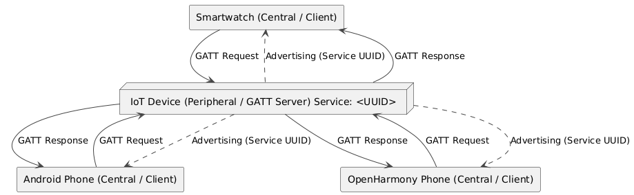

# app-oh-ble  
### BLE GATT client/server ###  

Applications that allows temperature data to be transmitted using BLE/GATT.

- android-BLEClient - BLE client app for Android
- oh-BLEClient - BLE client app for Open Harmony
- oh-GATTServer - GATT server app for Open Harmony

---

## 1. Introduction – BLE and GATT  

**Bluetooth Low Energy (BLE)** is a flavour of the **Bluetooth** technology built for ultra-low power consumption.  
It operates in the 2.4 GHz ISM band, keeps its radio active for very short intervals and therefore enables battery-powered devices to run for months or even years.  

The power efficiency comes at the cost of lower throughput (≈1 Mb/s) and smaller frame sizes compared to classic **Bluetooth**.  

**The Generic Attribute Profile (GATT)** sits on top of the [ATT protocol](https://www.bluetooth.com/wp-content/uploads/Files/Specification/HTML/Core-54/out/en/host/attribute-protocol--att-.html) in the **BLE** stack.  

It defines a hierarchy of services and characteristics plus the procedures for discovering, reading, writing, notifying and indicating those characteristics.  

[**GATT**](https://www.bluetooth.com/wp-content/uploads/Files/Specification/HTML/Core-54/out/en/host/generic-attribute-profile--gatt-.html) follows a strict client/server model:  
- A **client device** (e.g. a smartphone) issues requests to the **server** (peripheral).  
- The **server** replies with data or pushes notifications.  



---

## 2. Connection and reading data  

The following sequence diagram shows the run-time interactions from the moment the user presses **Connect** until the first temperature value is delivered to the UI.  

### Key points  
- Scanning filter ensures only packets with the desired **Service UUID** trigger `BLEDeviceFind`.  
- The Open Harmony stack delivers connection and GATT events asynchronously – `BleManager` reacts via registered callbacks.  
- Once the temperature characteristic is discovered, `BleManager` performs an initial read and enables notifications for subsequent updates.  


---

### 2.1 Step-by-step description (per diagram)  

1. The User presses the **Connect** button in the UI.  
2. The UI calls `connect()` on `BleManager`.  
3. `BleManager` asks the BLE Stack to `startScan(serviceUuid)`, starting a filtered scan by **Service UUID**.  
4. The BLE Stack begins scanning over the air and handles the radio-level procedures.  
5. The **Temperature Sensor** advertises. Because its packets include the expected **Service UUID**, the BLE Stack recognizes a match.  
6. The BLE Stack triggers the `BLEDeviceFind` callback in `BleManager`, passing the list of matching results.  
7. `BleManager` stops scanning (`stopScan()`) and initiates a connection `connect(deviceId)` to the selected device.  
8. The BLE Stack sends a **connection request** (`connectReq`) to the Sensor.  
9. After the link-layer procedure completes, the peers are connected; the BLE Stack emits `BLEConnectionStateChange(CONNECTED)` to `BleManager`.  
10. `BleManager` requests the list of services via `getServices()` from the BLE Stack.  
11. The BLE Stack returns the discovered `services[]` from the sensor.  
12. `BleManager` locates the temperature characteristic and performs `readCharacteristic(TEMP_CHAR)`.  
13. The BLE Stack sends a **Read Request** for that characteristic to the Sensor.  
14. The Sensor replies with a **Read Response** containing the temperature bytes.  
15. The BLE Stack delivers the value to `BleManager` (`value`).  
16. `BleManager` converts the bytes to a floating-point value (°C) and invokes the UI callback: `onTemperatureRead(temp)`.  

> **Note:** In a production build, right after steps 12/16 the manager typically also enables notifications (`setCharacteristicChangeNotification`) for subsequent temperature updates to avoid continuous polling.  

---

### Exceptional paths (summary)  

- **No devices found:** after the scan timeout, `BleManager` stops scanning and reports an *Error* state.  
- **Connection failure:** if the connection cannot be established, the stack won’t emit `CONNECTED`; `BleManager` can switch to *Error* or retry.  

---

## 3. GATT service hierarchy implemented by BleGattServer  

Below diagrams mirror the exact layout from the provided source (one primary service with two characteristics and a CCCD descriptor):  

- **Service UUID:** `12345678-1234-1000-8000-00805F9B34FB`  
- **Temperature Characteristic UUID:** `87654321-1234-1000-8000-00805F9B34FB` - READ, NOTIFY (float32/int32, little-endian)  
- **Unit Characteristic UUID:** `87654322-1234-1000-8000-00805F9B34FB` - READ, WRITE (uint8: 0=°C, 1=°F, …)  
- **CCCD UUID:** `00002902-0000-1000-8000-00805F9B34FB`  


---

### 3.1 Primary Service (`12345678-…`)  

Identifies a single, discoverable service that groups all temperature-related attributes.  
- **Discovery:** Clients find it during Primary Service Discovery.  
- **Usage:** UUID is used to filter scans and queries.  

---

### 3.2 Temperature Characteristic (`87654321-…`) - READ, NOTIFY  

- **Purpose:** Provides the current temperature reading from the IoT device.  
- **Format:** float32 little-endian (IEEE-754).  
  - Example: `25.0 °C → 00 00 C8 41 (LE)`  
- **Read:** Client issues *Read Request* → Server returns 4 bytes with current value.  
- **Notify:** When enabled via CCCD, server sends *Handle Value Notification* on changes or periodically.  
- **Units:** Based on Unit Characteristic (default = °C).  
- **Error handling:** Server may return an application error or sentinel value if data unavailable.  
- **Alternative encoding:** Optionally `int32` centi-degrees (e.g., `2512 = 25.12 °C`).  

---

### 3.3 Client-Characteristic-Configuration Descriptor (CCCD, `0x2902`)  

- **Role:** Allows client to enable/disable server-initiated updates for Temperature.  
- **Values (LE):**  
  - `0x0000` - Notifications off  
  - `0x0001` - Notify enabled  
  - `0x0002` - Indicate enabled (not used here)  
- **Per-connection:** Config is reset on disconnect.  
- **Flow:** Client typically calls `setCharacteristicChangeNotification()` and writes CCCD = `0x0001`.  

---

### 3.4 Unit Characteristic (`87654322-…`) - READ, WRITE  

- **Purpose:** Selects/reports the measurement unit for temperature values.  
- **Format:** `uint8` code  
  - `0 → °C`  
  - `1 → °F`  
  - Other → reserved  
- **Read:** Client checks unit before interpreting values.  
- **Write:** Client writes supported code to request change; server validates.  
- **Error handling:** Unsupported writes rejected with ATT error.  

---

### 3.5 Typical client sequences  

- **Initial connect & first value:**  
  Discover service → discover characteristics → read Unit → read Temperature → (optional) enable Notify via CCCD → receive notifications.  

- **Unit change:**  
  Write Unit = `1 (°F)` → (optional) read Unit back → subsequent readings in °F.  

- **Reconnection:**  
  CCCD resets to `0x0000`; client must re-enable notifications.  

---

### 3.6 Security & performance notes  

- **Security:** Reads may be open; writes (Unit) should require encryption/authentication if sensitive.  
- **MTU:** Default 23-byte MTU is sufficient for 4-byte payload.  
- **Caching:** Some platforms cache GATT layouts. If layout changes, expose *Service Changed (0x2A05)*.  
- **Multiple centrals:** Each connection maintains its own CCCD config and notification cadence.  


---

## 4. Implementing a BLE GATT Server in  OpenHarmony with ArkTS

This tutorial shows how to build a **Bluetooth Low Energy (BLE) GATT server** in OpenHarmony using **ArkTS**.

The server exposes a simple **Temperature Service** with two characteristics (temperature and unit).

### 4.1 Requesting Bluetooth Permissions

 Before initializing the BLE GATT server, the application must declare and obtain several permissions. OpenHarmony requires **Bluetooth and location permissions** to be granted in order to advertise,  connect, and exchange data over BLE. In our ArkTS app, we define an array of required permissions including Bluetooth usage, discovery, connectivity, and location permissions:

- `ohos.permission.USE_BLUETOOTH` – Allows the application to access general Bluetooth
configuration (such as the device’s Bluetooth state, name, etc.)
- `ohos.permission.DISCOVER_BLUETOOTH` – Allows the app to enable/disable Bluetooth,
initiate or cancel device discovery (scanning), and pair with other Bluetooth devices
- `ohos.permission.ACCESS_BLUETOOTH` - Allows the app to directly use Bluetooth features
like pairing with and connecting to peripheral devices. This permission is needed for performing BLE connections. 
- `ohos.permission.APPROXIMATELY_LOCATION`- Allows obtaining the approximate location
of the device. (Coarse location, required on newer API levels when using BLE.)
- `ohos.permission.LOCATION` - Allows obtaining the device’s precise location (fine location)
. BLE device scanning is treated as a location-sensitive operation, hence this permission is
required when the app is in use.

### Module manifest (`module.json5`) example
```typescript
"requestPermissions": [
  { "name": "ohos.permission.USE_BLUETOOTH" },
  { "name": "ohos.permission.DISCOVER_BLUETOOTH" },
  { "name": "ohos.permission.ACCESS_BLUETOOTH" },
  { "name": "ohos.permission.APPROXIMATELY_LOCATION" },
  { "name": "ohos.permission.LOCATION",
     "reason": "$string:permreason_location",
     "usedScene": { "abilities": [ ".EntryAbility" ], "when": "inuse" }
  }
]
```

Here we declare all five permissions. A `reason` string is provided for the location permission because it
is sensitive and requires user consent. The `usedScene` with `"when": "inuse"` indicates the
permission will be used while the app is in use (foreground).

### Runtime request (from `EntryAbility.ets`)
```typescript
const PERMS: Permissions[] = [
  'ohos.permission.USE_BLUETOOTH',
  'ohos.permission.DISCOVER_BLUETOOTH',
  'ohos.permission.ACCESS_BLUETOOTH',
  'ohos.permission.APPROXIMATELY_LOCATION',
  'ohos.permission.LOCATION'
];
```
Declaring in the manifest is not enough for sensitive permissions – the
app must also request them at runtime. In our ArkTS application, the `EntryAbility` (the main
UIAbility) handles this in its startup. We use a `PermissionManager` utility (wrapping OpenHarmony’s
permission APIs) to request the needed permissions when the application window is created. For
example:

```typescript
// In EntryAbility.ets onWindowStageCreate:
permissionManager.requestPermissions(this.context, PERMS, () => {
    // This callback executes only if *all* permissions in PERMS are granted
    console.info("All permissions granted, initializing BLE GATT server...");
    // ... proceed to initialize GATT server
});
```

In this code, PERMS is an array of the permission strings listed above. The app waits for the user to
grant all permissions. If any permission is denied, the example app shows a toast and exits gracefully
(since BLE operations won’t function without them). Only after obtaining all permissions do we proceed
to set up the GATT server.

---

### 4.2 Initializing the GATT Server

With permissions granted, we can initialize the BLE GATT server. OpenHarmony provides the
`@ohos.bluetooth.ble` module, which we import as `ble` , for GATT operations. We first obtain a
GATT server instance:


With permissions granted, we can initialize the BLE GATT server. OpenHarmony provides the @ohos.bluetooth.ble module, which we import as ble, for GATT operations. We first obtain a GATT server instance:

```typescript
// Create a new GATT server instance
this.gattServer = ble.createGattServer();  // Step 1: obtain GattServer object
console.info("GattServer instance created");
```

The call ble.createGattServer() returns a ble.GattServer object that represents our local GATT server. We store it (e.g., in this.gattServer). It’s good practice to ensure the device’s Bluetooth adapter is ON before this step – for example, by checking access.getState() from @ohos.bluetooth.access (which returns the adapter state). In our case, we simply log the state for debugging.

Next, we register event listeners on the GattServer to handle incoming requests from clients (we’ll detail these in Step 4). In the code, right after creating the GattServer, we call an addListeners() function to attach callbacks for read, write, and connection events. Now the server is ready to build and register GATT services.

---

### 4.3 Defining the GATT Service and Characteristics

A GATT server organizes data in a hierarchy of **services**, **characteristics**, and **descriptors**. We will create a primary service called “Temperature Service” with two characteristics:

- **Temperature Characteristic** – a 4-byte value (float32) representing temperature, readable by clients and notifiable (clients can subscribe to notifications).

- **Unit Characteristic** – a 1-byte value (uint8) representing the unit of temperature (e.g. `0 = °C`, `1 = °F`), which is **readable** and **writable** by clients.

- We will also include the standard **Client Characteristic Configuration Descriptor (CCCD)** on the Temperature characteristic (UUID `0x2902`), which allows a client to enable/disable notifications for that characteristic.

All UUIDs in this example are 128-bit values defined as constants in the code. For instance, the service UUID is `12345678-1234-1000-8000-00805F9B34FB` and the characteristic UUIDs are `87654321-1234-1000-8000-00805F9B34FB` (temperature) and `87654322-1234-1000-8000-00805F9B34FB` (unit). These are custom, randomly-generated UUIDs following the Bluetooth SIG format for custom services/characteristics.

Inside the `prepareGattServer()` method, we assemble the service and its components step by step:

```typescript
// Step 2: Create a Client Characteristic Configuration Descriptor (CCCD) for notifications
const cccdBuffer = new ArrayBuffer(2);
new Uint8Array(cccdBuffer).fill(0x00);  // default 0x0000 (notifications disabled)
const cccDescriptor: ble.BLEDescriptor = {
    serviceUuid: BleGattServer.SERVICE_UUID,
    characteristicUuid: BleGattServer.TEMP_CHAR_UUID,  // link to Temperature char
    descriptorUuid: BleGattServer.CCCD_UUID,           // standard CCCD UUID 0x2902
    descriptorValue: cccdBuffer
};

// Step 3: Define the Temperature characteristic (readable, notifiable)
const tempValueBuffer = new ArrayBuffer(4);  // placeholder 32-bit value
const tempCharacteristic: ble.BLECharacteristic = {
    serviceUuid: BleGattServer.SERVICE_UUID,
    characteristicUuid: BleGattServer.TEMP_CHAR_UUID,
    properties: { read: true, notify: true },        // allow reads and notifications
    characteristicValue: tempValueBuffer,            // initial value (can be all zeros)
    descriptors: [cccDescriptor]                     // attach the CCCD descriptor
};

// Step 4: Define the Unit characteristic (readable, writable)
const unitValueBuffer = new ArrayBuffer(1);
const unitCharacteristic: ble.BLECharacteristic = {
    serviceUuid: BleGattServer.SERVICE_UUID,
    characteristicUuid: BleGattServer.UNIT_CHAR_UUID,
    properties: { read: true, write: true },         // allow reads and writes
    characteristicValue: unitValueBuffer,
    descriptors: []                                  // no descriptors for this characteristic
};

// Step 5: Create the primary GATT service containing the two characteristics
const gattService: ble.GattService = {
    serviceUuid: BleGattServer.SERVICE_UUID,
    isPrimary: true,
    characteristics: [tempCharacteristic, unitCharacteristic],
    includeServices: []     // no included services in this example
};
```

In the code above, we first allocate a 2-byte buffer for the CCCD and fill it with `0x00 0x00` (which per BLE spec means *notifications/indications disabled by default*). We then construct the `cccDescriptor` object linking it to the Temperature characteristic’s UUID and the standard descriptor UUID `0x2902`. Next, we prepare the **Temperature characteristic** object with `properties: { read: true, notify: true }` and attach the CCCD descriptor to it. We also prepare the Unit characteristic with properties: `{ read: true, write: true }`. Each characteristic is given an initial value buffer (`tempValueBuffer` of 4 bytes, `unitValueBuffer` of 1 byte), which holds the current value of the characteristic. Finally, we create a GATT service object specifying our service UUID, marking it as primary, and bundling the two characteristics in a list.

---

### 4.4: Registering the Service with the GATT Server ###

After defining the `GattService` object, we must register it with the GattServer so that it becomes active and visible to connected clients. This is done by calling `GattServer.addService()`. In our code, we use an asynchronous call with `await` and wrap it in a try-catch:

```typescript
// Step 6: Register the service with the GATT server
try {
    await this.gattServer.addService(gattService);
    console.info(`GattService registered: ${gattService.serviceUuid}`);
} catch (e) {
    console.error(`addService failed: ${e.message}`);
}
```


If `addService` succeeds, our GATT server now knows about the Temperature Service and its characteristics. At this point, the BLE stack is ready for clients to discover this service once we start advertising (next step). If there were an error (for example, due to an invalid parameter), it would be caught and logged. Typically, you should call `addService` only **once** per service at startup. (Our `BleGattServer.prepareGattServer()` method is safe to call multiple times as it would overwrite the existing service with a new one if needed.)

---

### 4.5 Handling Client Connections and GATT Requests ###

Once the service is registered and advertising (later step) begins, remote BLE central devices can discover the service and connect to the GATT server. When a client is connected, they will perform GATT operations like reading a characteristic, writing to a characteristic, or subscribing for notifications. The OpenHarmony GATT server API uses event callbacks to notify the application of these actions. We set up these callbacks in the `addListeners()` method (invoked earlier during initialization):

- `characteristicRead` **event**: Triggered when a connected client reads a characteristic’s value. Our code provides a callback that prepares a response. For the Temperature characteristic, we generate a 4-byte little-endian float representing the current temperature reading and send it back:

```typescript
gattServer.on('characteristicRead', (req) => {
    console.info(`characteristicRead: ${JSON.stringify(req)}`);
    // Prepare a 4-byte buffer with the temperature (e.g., 23.8°C)
    const buf = new ArrayBuffer(4);
    new DataView(buf).setFloat32(0, 23.8, true);  // write 23.8 as float32 (little-endian)
    // Send a success response with the value
    this.gattServer!.sendResponse({
        deviceId: req.deviceId,
        transId:  req.transId,
        offset:   req.offset,
        status:   0,    // 0 = BLE_GATT_SUCCESS
        value:    buf   // the data to return
    });
});
```

In the above handler, `req` is a `CharacteristicReadRequest` containing details of the request (device, transaction ID, etc.). We create a buffer and use `DataView` to set a float32 value (23.8) at offset 0. Then we call `gattServer.sendResponse(...)` with `status: 0` (which indicates success) and attach our buffer as the value. This sends the response back to the client that requested the read. In a real application, you would likely maintain a variable for the current temperature (perhaps from a sensor) and use that value here instead of the hard-coded 23.8. The key point is that **for any read request, you must respond** using `sendResponse` with the appropriate status and data.

- `characteristicWrite` **event**: Triggered when a client writes to a characteristic. The request object would contain the value the client wants to write. In our example, we simply log the write request and do not send an immediate response. (The OpenHarmony BLE framework will handle acknowledging the write if needed – typically, for a Write Request, the server should call `sendResponse` to confirm receipt, whereas Write Without Response requires no acknowledgment. You can check the `req` details to determine if a response is expected, and call `sendResponse({status: 0})` accordingly to acknowledge a write.) For example, if a client writes a new unit (0 or 1) to the Unit characteristic, you could update the server’s stored unit setting. Our simple implementation omits the actual state update for brevity.

- `descriptorRead` / `descriptorWrite` **events**: These correspond to a client reading or writing a descriptor’s value. In our case, the relevant descriptor is the CCCD on the Temperature characteristic (for enabling/disabling notifications). We log these events as well. A client writing to the CCCD will typically send `0x0001` to enable notifications or `0x0000` to disable. The BLE stack may handle the basics, but you could use this event to track the subscribed state if your application needs to know when to start sending notifications.

- `connectionStateChange` **event**: Indicates when a central device connects to or disconnects from the GATT server. The callback provides a state object; our code logs it. You can use this to detect when a device has successfully connected (to perhaps start some data generation) or when it disconnects (to stop certain activities or clean up resources).

- `BLEMtuChange` **event**: Indicates that the ATT MTU (Maximum Transmission Unit) has changed (usually negotiated right after connection). We also log this. Knowing the MTU is useful if you plan to send notifications with a payload larger than the default 23 bytes, as a larger MTU allows bigger packets.

All these listeners are set up on the `gattServer` object. In our example, aside from the read request (where we actually call `sendResponse` with data), the other event handlers simply log the event. In a real-world scenario, you would add logic to handle writes (e.g., update the stored value or configuration), handle descriptor writes (e.g., start sending notifications if enabled), and possibly send periodic notifications when the value changes. If you wanted to send a notification update to subscribed clients (for example, periodically sending a new temperature reading), you could use `gattServer.notifyCharacteristicChanged(deviceId, characteristic, confirm)` or a similar API provided by OpenHarmony to push notifications. (Ensure a client has written `0x0001` to the CCCD before sending notifications.)

---

### 4.6 Starting BLE Advertising

For other devices to find and connect to our GATT server, we must advertise it. BLE advertising makes the device discoverable and broadcasts the existence of the GATT service. In OpenHarmony, advertising is managed through the `ble` module as well. We configure advertising with an **advertising packet** and a **scan response packet**:

```typescript
// (If already advertising, stop it first to avoid duplicates)
if (this.advertisingOn) {
    ble.stopAdvertising();
    this.advertisingOn = false;
}

// Set advertising parameters (connectable, medium TX power, 100ms interval)
const setting: ble.AdvertiseSetting = {
    interval: 160,    // advertising interval: 160 * 0.625ms = 100 ms
    txPower: -7,      // transmit power in dBm (−7 dBm, about medium level)
    connectable: true // we want to allow connections
};

// Optional manufacturer-specific data to include in advertisement
const manufacturerData: ble.ManufactureData = {
    manufactureId: 0x1234,                              // example manufacturer ID
    manufactureValue: new Uint8Array([1, 2, 3, 4]).buffer // example 4-byte payload
};

// Primary advertising data – advertises our service UUID so scanners can see it
const advData: ble.AdvertiseData = {
    serviceUuids: [BleGattServer.SERVICE_UUID],  // advertise the service UUID
    manufactureData: [manufacturerData],         // include manufacturer data (optional)
    serviceData: [], 
    includeDeviceName: false                    // don't include name here (we'll use scan response for the name)
};

// Scan response data – this is sent in response to active scans
const advResp: ble.AdvertiseData = {
    serviceUuids: [], 
    manufactureData: [], 
    serviceData: [],
    includeDeviceName: true    // include the device name in scan response
};

// Start advertising
await ble.startAdvertising(setting, advData, advResp);
this.advertisingOn = true;
console.info("Advertising started successfully");
```
---

Let’s break down the advertising setup:

- We ensure any existing advertisement is stopped (`ble.stopAdvertising()`) to prevent duplicates (our code logs a warning and resets state if advertising was already on).

- We create an `AdvertiseSetting` with a 100 ms interval and medium TX power. A shorter interval makes the device advertise more frequently (increasing chance of discovery at the cost of slightly higher power usage). The `connectable: true` flag is important because we want central devices to be able to connect to our GATT server (non-connectable advertising would only be used for broadcast beacons).

- We prepare a manufacturer-specific data field (this is optional, shown for demonstration). In our example, we use a dummy 16-bit manufacturer ID (`0x1234`) and a 4-byte payload `[0x01,0x02,0x03,0x04]`. This could be used to broadcast custom data or an identifier for your device’s manufacturer.

- We set up the main advertising data (`advData`) to include the UUID of our Temperature Service. Advertising the service UUID is useful because scanners (central devices) can **filter** on known service UUIDs to find relevant peripherals. We also attach the manufacturer data here. We set `includeDeviceName: false` to keep the advertisement packet small; instead, we will send the device name in the separate scan response.

- We set up a scan response (`advResp`) that includes the device name (and no other data for brevity). The device name is often included in scan responses to allow the central to display a human-readable name when the user scans for devices.

- Finally, we call `ble.startAdvertising(setting, advData, advResp)`. This begins advertising with our specified parameters. After this promise resolves, our device is advertising and `advertisingOn` is set to true. If an error occurs (e.g., if advertising is not supported or Bluetooth is off), it will throw and we log the error code.

At this point, the BLE peripheral (our device) is advertising its presence. Any BLE central (for example, another OpenHarmony device in central mode or a smartphone app) can scan and discover our device. They will see the service UUID in the advertisement and the device name in the scan response. Because we marked the advertisement as connectable, a scanner can initiate a connection. Once connected, the GATT service we registered will be visible to the client, and they can perform service discovery, then read or write the characteristics as defined.

---

## 5. Implementing a BLE GATT Client in OpenHarmony

Bluetooth Low Energy (BLE) lets a mobile device act as a **central GATT client**, connecting to peripheral GATT servers (e.g., sensors). In this tutorial, we will build an ArkTS app running on OpenHarmony (API ≥ 12) that scans for a BLE device exposing a **“Temperature Service”**, connects to it, and reads the temperature value from a GATT characteristic. We assume you know the **service and characteristic UUIDs** exposed by the BLE server, the client filters devices by this UUID and then uses GATT to read data. The app uses **ArkUI with ArkTS** (declarative UI in TypeScript) to provide a user interface for connecting and displaying the current temperature.

> **Note:** You need another BLE device acting as a GATT server with the appropriate service (e.g., an OpenHarmony device running the tutorial **Temperature Service** from the previous part). Our BLE client, as a **central**, will connect to it.

---

### 5.1 Required Bluetooth and Location permissions

Before scanning and connecting over BLE, the app must obtain the necessary permissions from the user. The permissions setting is identical to that for the GATT server implementation:

```ts
const PERMS: Permissions[] = [
  'ohos.permission.USE_BLUETOOTH',
  'ohos.permission.DISCOVER_BLUETOOTH',
  'ohos.permission.ACCESS_BLUETOOTH',
  'ohos.permission.APPROXIMATELY_LOCATION',
  'ohos.permission.LOCATION'
];

const permissionManager = new PermissionManager();
permissionManager.requestPermissions(this.context, PERMS, () => {
  // All permissions granted:
  windowStage.loadContent('pages/Index', (err) => {

    // Load content ot error handling...

  });
});
```

This ensures that before starting BLE scanning the app has Bluetooth and Location access. If the user denies any required permission, handle it appropriately (e.g., show a message and exit the BLE flow since operations won’t work).

---

### 5.2 Initialize the BLE client and start scanning

After permissions, initialize the Bluetooth Low Energy module and **scan for a device exposing the target GATT service**. This logic lives in the `BleManager` class (file **BleManager.ts**). It manages BLE connection state, performs scanning, connects to a selected device, and reads data.

At the top, `BleManager` defines **service and characteristic UUIDs** used in the example:

```ts
const SERVICE_UUID = '12345678-1234-1000-8000-00805F9B34FB';
const TEMP_CHAR_UUID = '87654321-1234-1000-8000-00805F9B34FB';
```

We assume the target peripheral advertises the `SERVICE_UUID` (e.g., the Temperature Service server uses these identifiers). This allows filtering scan results by that identifier, **looking only for devices offering our service**.

The `connect()` method on `BleManager` starts the process of connecting to a BLE device. It first checks whether Bluetooth is turned on using `@ohos.bluetooth.access`:

```ts
private ensureBluetoothOn(): boolean {
  const state = access.getState();
  hilog.debug(DOMAIN, TAG, `Checking Bluetooth state -> ${state}`);
  if (state !== access.BluetoothState.STATE_ON) {
    hilog.error(DOMAIN, TAG, 'Bluetooth is not enabled');
    this.updateConnectionState(BleConnectionState.Error);
    return false;
  }
  return true;
}
```

Then `connect()` sets the state to **Scanning** and starts BLE scanning:

```ts
this.updateConnectionState(BleConnectionState.Scanning);
hilog.info(DOMAIN, TAG, 'Starting BLE scan');

// We set up a hardware filter – only devices containing our SERVICE_UUID
ble.on('BLEDeviceFind', this.onDeviceFound);
ble.startBLEScan([{ serviceUuid: SERVICE_UUID }], {
  dutyMode: ble.ScanDuty.SCAN_MODE_LOW_LATENCY
});
```

Additionally, `BleManager.connect()` sets a **timeout** in case no device is found within a given time (e.g., 30 seconds):

```ts
this.scanTimeoutId = setTimeout(() => {
  hilog.warn(DOMAIN, TAG, 'Scan timeout reached');
  if (this.connectionState === BleConnectionState.Scanning) {
    this.stopScan();
    this.updateConnectionState(BleConnectionState.Error);
  }
}, this.SCAN_TIMEOUT);
```

---

### 5.3 Detect a device and establish a GATT connection

Whenever the scanner finds a device that matches the criterion (has the `SERVICE_UUID`), our `onDeviceFound` callback is invoked with `Array<ble.ScanResult>`. In our implementation, we take the **first found device**, assuming it is our target sensor. Snippet of `onDeviceFound` in `BleManager`:

```ts
private onDeviceFound = (results: Array<ble.ScanResult>): void => {
  hilog.info(DOMAIN, TAG, `Found ${results.length} devices`);
  if (!results.length) return;

  const deviceId = results[0].deviceId;
  hilog.info(DOMAIN, TAG, `Connecting to device: [${deviceId}] ${connection.getRemoteDeviceName(deviceId)}`);

  this.stopScan();
  this.updateConnectionState(BleConnectionState.Connecting);

  this.gatt = ble.createGattClientDevice(deviceId);
  this.gatt.on('BLEConnectionStateChange', this.onConnectionChange);

  try {
    hilog.debug(DOMAIN, TAG, 'Initiating GATT connection');
    this.gatt.connect();
  } catch (error) {
    hilog.error(DOMAIN, TAG, `Connection error: ${error}`);
    this.updateConnectionState(BleConnectionState.Error);
  }
};
```

---

### 5.4 Discover GATT services and read the temperature characteristic

`onConnectionChange` in `BleManager` is called with a `ble.BLEConnectionChangeState` object. We read `state` and compare it against `@ohos.bluetooth.constant.ProfileConnectionState` constants. We handle two key cases: **CONNECTED** and **DISCONNECTED**. The handler looks like this:

```ts
private onConnectionChange = async (ev: ble.BLEConnectionChangeState) => {
  hilog.info(DOMAIN, TAG, `Connection state changed: ${ev.state}`);

  if (ev.state === constant.ProfileConnectionState.STATE_CONNECTED) {
    hilog.info(DOMAIN, TAG, 'Device connected, discovering services');
    this.updateConnectionState(BleConnectionState.Connected);

    try {
      const services = await this.gatt!.getServices();
      hilog.debug(DOMAIN, TAG, `Found ${services.length} services`);

      const tempChar = services
        .flatMap(s => s.characteristics)
        .find(c => c.characteristicUuid.toLowerCase() === TEMP_CHAR_UUID.toLowerCase());

      if (!tempChar) {
        throw new Error('Temperature characteristic not found');
      }

      // Initial temperature reading
      hilog.debug(DOMAIN, TAG, 'Reading initial temperature value');
      await this.readTemperature(tempChar);


    } catch (e) {
      hilog.error(DOMAIN, TAG, `GATT operation error: ${(e as BusinessError).message}`);
      this.updateConnectionState(BleConnectionState.Error);
    }
  } else if (ev.state === constant.ProfileConnectionState.STATE_DISCONNECTED) {
    hilog.info(DOMAIN, TAG, 'Device disconnected');
    this.disconnect();
  }
};
```

Our `disconnect()` cancels any ongoing scan, closes the GATT connection, and clears state so the UI reflects we’re disconnected:

```ts
public disconnect(): void {
  hilog.info(DOMAIN, TAG, 'Disconnecting from device');
  this.stopScan();

  try {
    if (this.gatt) {
      hilog.debug(DOMAIN, TAG, 'Closing GATT connection');
      this.gatt.disconnect();
      this.gatt.close();
    }
  } catch (error) {
    hilog.error(DOMAIN, TAG, `Error during disconnect: ${error}`);
  }

  this.gatt = undefined;
  this.updateTemperature(null);
  this.updateConnectionState(BleConnectionState.Disconnected);
}
```

#### Reading a characteristic value

Now let’s look at `readTemperature(char)` called after connecting. It reads the remote temperature characteristic value, converts it to a number, and updates our state:

```ts
private async readTemperature(char: ble.BLECharacteristic): Promise<void> {
  hilog.debug(DOMAIN, TAG, 'Reading temperature characteristic');
  const updated = await this.gatt!.readCharacteristicValue(char);
  const temp = this.bytesToFloat(updated.characteristicValue);
  hilog.info(DOMAIN, TAG, `Temperature read: ${temp}`);
  this.updateTemperature(temp);
}
```

Helper `bytesToFloat` handles the conversion:

```ts
private bytesToFloat(buf: ArrayBuffer): number {
  const dv = new DataView(buf);
  return dv.getFloat32(0, true);  // little-endian
}
```

---

### 5.5 UI integration

The OpenHarmony app uses the **declarative ArkUI** written in ArkTS for user interaction. In our example, all UI logic is in **Index.ets**, which defines the main page component. The component is defined with the `@Component` decorator on `struct Index`. The `@Entry` decorator marks it as the **UI entry**, loaded first (as arranged in `EntryAbility`). Inside, we use `@State` variables to hold dynamic app state (e.g., temperature, connection status). **Changing such variables triggers automatic UI re‑render** thanks to ArkUI mechanisms. Here is a fragment of the component definition:

```ts
@Entry
@Component
struct Index {
  /** BLE manager instance for handling Bluetooth operations */
  private bleManager: BleManager = new BleManager();

  /** Current temperature value read from the BLE device */
  @State temperature: number | null = null;

  /** Flag: whether the device is currently connected */
  @State connected: boolean = false;

  /** Current connection status (text)) */
  @State status: string = "";
  ...
}
```

#### Reacting to BLE state changes

A key place is the **lifecycle method** `aboutToAppear()` of `Index`. It’s called just before the component appears, good time to subscribe to events and initialize data. We use it to register callbacks in `BleManager` so state changes and temperature reads update our @State variables:

```ts
aboutToAppear() {
  console.debug("[Index] aboutToAppear()");
  
  // Set temperature read callback
  this.bleManager.setOnTemperatureRead(temp => {
    console.debug(`[Index] setOnTemperatureRead -> ${temp}`);
    this.temperature = temp;
  });
  
  // Set connection status change callback
  this.bleManager.setOnConnectionChange(state => {
    console.debug(`[Index] setOnConnectionChange -> ${state}: ${BleConnectionState[state]}`);
    this.status = BleConnectionState[state];
    
    // Update connection flag and clear temp. after disconnecting
    if (state === BleConnectionState.Connected) {
      this.connected = true;
    } else {
      this.connected = false;
      this.temperature = null;
    }
  });
}
```

#### Building the user interface

The component’s `build()` method describes **how the UI should look**. It uses ArkUI primitives such as **Column**, **Text**, **Button** to declaratively build the view tree. Below is a simplified excerpt of `build()` with comments:

```ts
build() {
  RelativeContainer() {
    Column() {
      // App header
      Text('BLE Client')
        .fontSize($r('app.float.page_text_font_size'))
        .fontWeight(FontWeight.Bold)

      // Connect/Disconnect Button
      Button(this.connected ? 'Disconnect' : 'Connect')
        .onClick(() => this.onConnectButtonClick())
        .margin(16)

      // Displaying the temperature (with a thermometer emoticon)
      Text(
        this.temperature !== null
          ? `🌡️ ${this.temperature.toFixed(2)} °C`
          : 'no data'
      )
        .fontSize($r('app.float.page_text_font_size'))
        .fontWeight(FontWeight.Bold)

      // Connection status text
      Text(this.status)
        .fontSize($r('app.float.page_text_font_size'))
    }
    // Column alignment settings (centring on the screen)
    .alignRules({
      center: { anchor: '__container__', align: VerticalAlign.Center },
      middle: { anchor: '__container__', align: HorizontalAlign.Center }
    })
  }
  .height('100%')
  .width('100%')
}
```

The UI is simple and clear: a **Connect/Disconnect** button, the current temperature (or *no data*), and the textual **status**. ArkUI automatically refreshes the interface whenever observed `@State` variables change, so the button label, temperature text, and status update in real time.

---

### Summary

In this tutorial we implemented a full **BLE GATT client** flow in OpenHarmony using ArkTS and ArkUI. The app requests permissions (Bluetooth + Location), then uses `@ohos.bluetooth.ble` to scan devices (filtered by service UUID), connects as a GATT Client, discovers services/characteristics, and reads the temperature. The value is displayed in a declarative ArkUI interface, using `@State` for automatic updates and click handlers to connect or disconnect. This architecture separates BLE logic (`BleManager`) from UI logic (ArkUI `Index`), improving maintainability. This sample targets **API level 12**, using ArkTS capabilities available since OpenHarmony 3.1 (stage model).

After launching the app, with Bluetooth on and permissions granted, tap **“Connect”** to start BLE scanning. When the Temperature service server is found, the app automatically establishes a GATT connection. Within a few seconds you should see *Connected* and the temperature value (assuming the server populated the characteristic). The button label changes to **“Disconnect”**; pressing it again triggers disconnection, the status becomes *Disconnected* and the temperature shows *no data*. This basic BLE client can serve as a starting point for more advanced scenarios (multiple devices, pairing, notifications, additional characteristics), while the fundamentals-permissions, scanning, GATT connection, and reads-remain the same.

---

