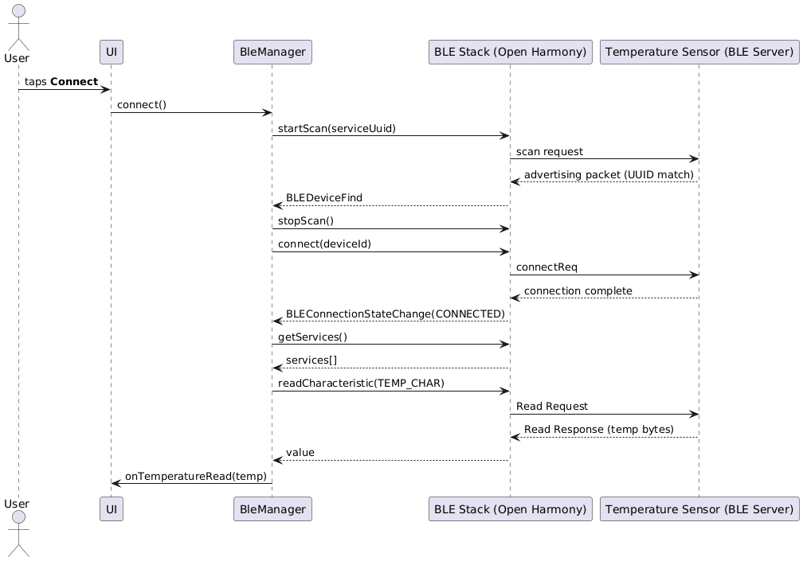

# app-oh-ble  
BLE GATT client/server  

---

## 1. Introduction – BLE and GATT  

**Bluetooth Low Energy (BLE)** is a flavour of the **Bluetooth** technology built for ultra-low power consumption.  
It operates in the 2.4 GHz ISM band, keeps its radio active for very short intervals and therefore enables battery-powered devices to run for months or even years.  

The power efficiency comes at the cost of lower throughput (≈1 Mb/s) and smaller frame sizes compared to classic **Bluetooth**.  

**The Generic Attribute Profile (GATT)** sits on top of the [ATT protocol](https://www.bluetooth.com/wp-content/uploads/Files/Specification/HTML/Core-54/out/en/host/attribute-protocol--att-.html) in the **BLE** stack.  

It defines a hierarchy of services and characteristics plus the procedures for discovering, reading, writing, notifying and indicating those characteristics.  

[**GATT**](https://www.bluetooth.com/wp-content/uploads/Files/Specification/HTML/Core-54/out/en/host/generic-attribute-profile--gatt-.html) follows a strict client/server model:  
- A **client device** (e.g. a smartphone) issues requests to the **server** (peripheral).  
- The **server** replies with data or pushes notifications.  

---

## 2. Connection and reading data  

The following sequence diagram shows the run-time interactions from the moment the user presses **Connect** until the first temperature value is delivered to the UI.  

### Key points  
- Scanning filter ensures only packets with the desired **Service UUID** trigger `BLEDeviceFind`.  
- The Open Harmony stack delivers connection and GATT events asynchronously – `BleManager` reacts via registered callbacks.  
- Once the temperature characteristic is discovered, `BleManager` performs an initial read and enables notifications for subsequent updates.  

---

### 2.1 Step-by-step description (per diagram)  

1. The User presses the **Connect** button in the UI.  
2. The UI calls `connect()` on `BleManager`.  
3. `BleManager` asks the BLE Stack to `startScan(serviceUuid)`, starting a filtered scan by **Service UUID**.  
4. The BLE Stack begins scanning over the air and handles the radio-level procedures.  
5. The **Temperature Sensor** advertises. Because its packets include the expected **Service UUID**, the BLE Stack recognizes a match.  
6. The BLE Stack triggers the `BLEDeviceFind` callback in `BleManager`, passing the list of matching results.  
7. `BleManager` stops scanning (`stopScan()`) and initiates a connection `connect(deviceId)` to the selected device.  
8. The BLE Stack sends a **connection request** (`connectReq`) to the Sensor.  
9. After the link-layer procedure completes, the peers are connected; the BLE Stack emits `BLEConnectionStateChange(CONNECTED)` to `BleManager`.  
10. `BleManager` requests the list of services via `getServices()` from the BLE Stack.  
11. The BLE Stack returns the discovered `services[]` from the sensor.  
12. `BleManager` locates the temperature characteristic and performs `readCharacteristic(TEMP_CHAR)`.  
13. The BLE Stack sends a **Read Request** for that characteristic to the Sensor.  
14. The Sensor replies with a **Read Response** containing the temperature bytes.  
15. The BLE Stack delivers the value to `BleManager` (`value`).  
16. `BleManager` converts the bytes to a floating-point value (°C) and invokes the UI callback: `onTemperatureRead(temp)`.  

> **Note:** In a production build, right after steps 12/16 the manager typically also enables notifications (`setCharacteristicChangeNotification`) for subsequent temperature updates to avoid continuous polling.  

---

### Exceptional paths (summary)  

- **No devices found:** after the scan timeout, `BleManager` stops scanning and reports an *Error* state.  
- **Connection failure:** if the connection cannot be established, the stack won’t emit `CONNECTED`; `BleManager` can switch to *Error* or retry.  

---

## 3. GATT service hierarchy implemented by BleGattServer  

Below diagrams mirror the exact layout from the provided source (one primary service with two characteristics and a CCCD descriptor):  

- **Service UUID:** `12345678-1234-1000-8000-00805F9B34FB`  
- **Temperature Characteristic UUID:** `87654321-1234-1000-8000-00805F9B34FB` — READ, NOTIFY (float32/int32, little-endian)  
- **Unit Characteristic UUID:** `87654322-1234-1000-8000-00805F9B34FB` — READ, WRITE (uint8: 0=°C, 1=°F, …)  
- **CCCD UUID:** `00002902-0000-1000-8000-00805F9B34FB`  

---

### 3.1 Primary Service (`12345678-…`)  

Identifies a single, discoverable service that groups all temperature-related attributes.  
- **Discovery:** Clients find it during Primary Service Discovery.  
- **Usage:** UUID is used to filter scans and queries.  

---

### 3.2 Temperature Characteristic (`87654321-…`) — READ, NOTIFY  

- **Purpose:** Provides the current temperature reading from the IoT device.  
- **Format:** float32 little-endian (IEEE-754).  
  - Example: `25.0 °C → 00 00 C8 41 (LE)`  
- **Read:** Client issues *Read Request* → Server returns 4 bytes with current value.  
- **Notify:** When enabled via CCCD, server sends *Handle Value Notification* on changes or periodically.  
- **Units:** Based on Unit Characteristic (default = °C).  
- **Error handling:** Server may return an application error or sentinel value if data unavailable.  
- **Alternative encoding:** Optionally `int32` centi-degrees (e.g., `2512 = 25.12 °C`).  

---

### 3.3 Client-Characteristic-Configuration Descriptor (CCCD, `0x2902`)  

- **Role:** Allows client to enable/disable server-initiated updates for Temperature.  
- **Values (LE):**  
  - `0x0000` — Notifications off  
  - `0x0001` — Notify enabled  
  - `0x0002` — Indicate enabled (not used here)  
- **Per-connection:** Config is reset on disconnect.  
- **Flow:** Client typically calls `setCharacteristicChangeNotification()` and writes CCCD = `0x0001`.  

---

### 3.4 Unit Characteristic (`87654322-…`) — READ, WRITE  

- **Purpose:** Selects/reports the measurement unit for temperature values.  
- **Format:** `uint8` code  
  - `0 → °C`  
  - `1 → °F`  
  - Other → reserved  
- **Read:** Client checks unit before interpreting values.  
- **Write:** Client writes supported code to request change; server validates.  
- **Error handling:** Unsupported writes rejected with ATT error.  

---

### 3.5 Typical client sequences  

- **Initial connect & first value:**  
  Discover service → discover characteristics → read Unit → read Temperature → (optional) enable Notify via CCCD → receive notifications.  

- **Unit change:**  
  Write Unit = `1 (°F)` → (optional) read Unit back → subsequent readings in °F.  

- **Reconnection:**  
  CCCD resets to `0x0000`; client must re-enable notifications.  

---

### 3.6 Security & performance notes  

- **Security:** Reads may be open; writes (Unit) should require encryption/authentication if sensitive.  
- **MTU:** Default 23-byte MTU is sufficient for 4-byte payload.  
- **Caching:** Some platforms cache GATT layouts. If layout changes, expose *Service Changed (0x2A05)*.  
- **Multiple centrals:** Each connection maintains its own CCCD config and notification cadence.  
