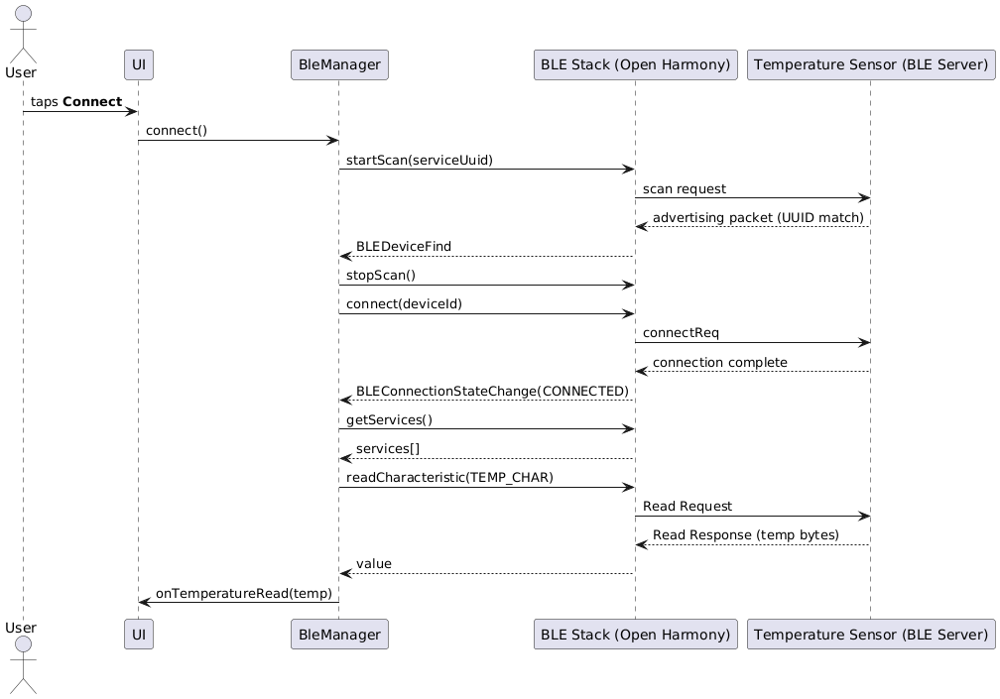

# 2. Connection and reading data

The following sequence diagram shows the run-time interactions from the moment the user presses **Connect** until the first temperature value is delivered to the UI.  

## Key points  
- Scanning filter ensures only packets with the desired **Service UUID** trigger `BLEDeviceFind`.  
- The Open Harmony stack delivers connection and GATT events asynchronously – `BleManager` reacts via registered callbacks.  
- Once the temperature characteristic is discovered, `BleManager` performs an initial read and enables notifications for subsequent updates.  

---

## 2.1 Step-by-step description (per diagram)  

1. The User presses the **Connect** button in the UI.  
2. The UI calls `connect()` on `BleManager`.  
3. `BleManager` asks the BLE Stack to `startScan(serviceUuid)`, starting a filtered scan by **Service UUID**.  
4. The BLE Stack begins scanning over the air and handles the radio-level procedures.  
5. The **Temperature Sensor** advertises. Because its packets include the expected **Service UUID**, the BLE Stack recognizes a match.  
6. The BLE Stack triggers the `BLEDeviceFind` callback in `BleManager`, passing the list of matching results.  
7. `BleManager` stops scanning (`stopScan()`) and initiates a connection `connect(deviceId)` to the selected device.  
8. The BLE Stack sends a **connection request** (`connectReq`) to the Sensor.  
9. After the link-layer procedure completes, the peers are connected; the BLE Stack emits `BLEConnectionStateChange(CONNECTED)` to `BleManager`.  
10. `BleManager` requests the list of services via `getServices()` from the BLE Stack.  
11. The BLE Stack returns the discovered `services[]` from the sensor.  
12. `BleManager` locates the temperature characteristic and performs `readCharacteristic(TEMP_CHAR)`.  
13. The BLE Stack sends a **Read Request** for that characteristic to the Sensor.  
14. The Sensor replies with a **Read Response** containing the temperature bytes.  
15. The BLE Stack delivers the value to `BleManager` (`value`).  
16. `BleManager` converts the bytes to a floating-point value (°C) and invokes the UI callback: `onTemperatureRead(temp)`.  

> **Note:** In a production build, right after steps 12/16 the manager typically also enables notifications (`setCharacteristicChangeNotification`) for subsequent temperature updates to avoid continuous polling.  

---

## Exceptional paths (summary)  

- **No devices found:** after the scan timeout, `BleManager` stops scanning and reports an *Error* state.  
- **Connection failure:** if the connection cannot be established, the stack won't emit `CONNECTED`; `BleManager` can switch to *Error* or retry.  