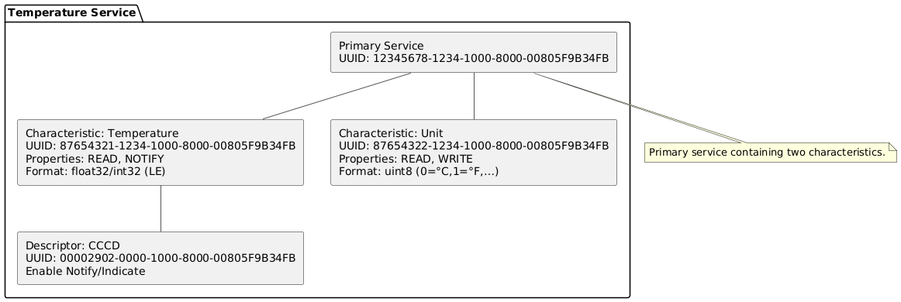

# 3. GATT service hierarchy implemented by BleGattServer

Below diagrams mirror the exact layout from the provided source (one primary service with two characteristics and a CCCD descriptor):  

- **Service UUID:** `12345678-1234-1000-8000-00805F9B34FB`  
- **Temperature Characteristic UUID:** `87654321-1234-1000-8000-00805F9B34FB` - READ, NOTIFY (float32/int32, little-endian)  
- **Unit Characteristic UUID:** `87654322-1234-1000-8000-00805F9B34FB` - READ, WRITE (uint8: 0=°C, 1=°F, …)  
- **CCCD UUID:** `00002902-0000-1000-8000-00805F9B34FB`  

---

## 3.1 Primary Service (`12345678-…`)  

Identifies a single, discoverable service that groups all temperature-related attributes.  
- **Discovery:** Clients find it during Primary Service Discovery.  
- **Usage:** UUID is used to filter scans and queries.  

---

## 3.2 Temperature Characteristic (`87654321-…`) - READ, NOTIFY  

- **Purpose:** Provides the current temperature reading from the IoT device.  
- **Format:** float32 little-endian (IEEE-754).  
  - Example: `25.0 °C → 00 00 C8 41 (LE)`  
- **Read:** Client issues *Read Request* → Server returns 4 bytes with current value.  
- **Notify:** When enabled via CCCD, server sends *Handle Value Notification* on changes or periodically.  
- **Units:** Based on Unit Characteristic (default = °C).  
- **Error handling:** Server may return an application error or sentinel value if data unavailable.  
- **Alternative encoding:** Optionally `int32` centi-degrees (e.g., `2512 = 25.12 °C`).  

---

## 3.3 Client-Characteristic-Configuration Descriptor (CCCD, `0x2902`)  

- **Role:** Allows client to enable/disable server-initiated updates for Temperature.  
- **Values (LE):**  
  - `0x0000` - Notifications off  
  - `0x0001` - Notify enabled  
  - `0x0002` - Indicate enabled (not used here)  
- **Per-connection:** Config is reset on disconnect.  
- **Flow:** Client typically calls `setCharacteristicChangeNotification()` and writes CCCD = `0x0001`.  

---

## 3.4 Unit Characteristic (`87654322-…`) - READ, WRITE  

- **Purpose:** Selects/reports the measurement unit for temperature values.  
- **Format:** `uint8` code  
  - `0 → °C`  
  - `1 → °F`  
  - Other → reserved  
- **Read:** Client checks unit before interpreting values.  
- **Write:** Client writes supported code to request change; server validates.  
- **Error handling:** Unsupported writes rejected with ATT error.  

---

## 3.5 Typical client sequences  

- **Initial connect & first value:**  
  Discover service → discover characteristics → read Unit → read Temperature → (optional) enable Notify via CCCD → receive notifications.  

- **Unit change:**  
  Write Unit = `1 (°F)` → (optional) read Unit back → subsequent readings in °F.  

- **Reconnection:**  
  CCCD resets to `0x0000`; client must re-enable notifications.  

---

## 3.6 Security & performance notes  

- **Security:** Reads may be open; writes (Unit) should require encryption/authentication if sensitive.  
- **MTU:** Default 23-byte MTU is sufficient for 4-byte payload.  
- **Caching:** Some platforms cache GATT layouts. If layout changes, expose *Service Changed (0x2A05)*.  
- **Multiple centrals:** Each connection maintains its own CCCD config and notification cadence.  